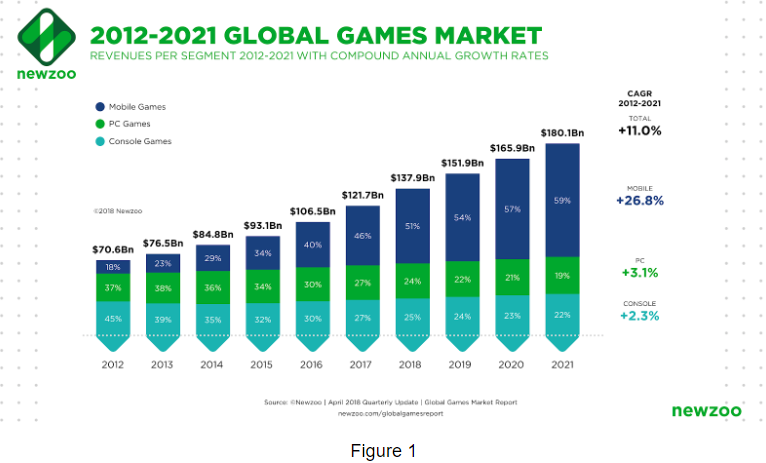

# ANLY 502 - Final Project 

## Modeling and Sentiment Analysis of Amazon Review and Twitch Stream Data

### Team: 5 AM

### Teammates: Hao Liu, Jianhao Ji, Qian Yi, Jingyu Zhang

## Executive Summary

(1) Download and unzip Amazon Review data by using hadoop. Download the Twitch game data on the local machine, then unzip the .rar format data. Save the datasets in s3 bucket. 

(2) Implement SparkSQL techniques to extract critical data, then perform data cleaning and data preprocessing. 

(3) Build NLP models with Logistic Regression, TFIDF, Naive Bayes, Random Forest and Vader methods. Then compare model accuracies. 

(4) Create Visualizations to better understand game trends and overall ratings. Generate insights based on the results. 

## Introduction

Over the past 20 years, video games have begun to shift in purpose and use. Up until 1994, games were not much more than time killers and competitive electronic games. The most vocal of this camp is the famous film critic Roger Ebert. He publicly battled against the perception of video games becoming art from 2006. But nowadays, with the flourish of gaming companies and development of gaming peripheral industries(figure 1), more and more people consider video games as a new form of art as well as one essential in daily lives.

# Figure 1

Just like other forms of arts, there are a thousand Hamlets in a thousand people's eyes, one's attitude towards games could be hugely affected by their preference of game types, their culture, their background etc. Since the centers of games are always the players, their reviews and tendencies matter. Here comes one crucial problem: how to rate a game by its review and how to judge whether a game is trending.

In our project, we are going to focus on games’ reviews on Amazon and streaming tendencies on Twitch. We all know that the Amazon review section contains ‘Overall Rate’ and ‘Review’ where customers can both express their opinions on games they purchased and give them a score. We are going to implement sentiment analysis on current Amazon review datasets then conclude a reliable model to convert players’ review to numeric rates. Besides, we will analyze Twitch Streaming datasets and figure out the trending video games.

## Dataset

#### Dataset one: Amazon Product Review Dataset

This dataset includes review ID, product ID, reviewer name, overall rating, summary, helpful vote, and review time. It includes all product categories from Amazon Fashion to Video Games. 

Unzip size: 54GB 

#### Dataset two: Twitch Streaming Dataset

This dataset includes Stream ID, current views, stream created time, game name, broadcaster ID, delay setting, follower number, partner status, language etc. 

Unzip size: 6.9GB

## Code files

(1) Data_cleaning.ipynb 

(2) EDA twitch and Amazon_game.ipynb 

(3) Logistic Regression.ipynb

(4) TFIDF_cross_validation.ipynb 

(5) NaiveBayes RandomForest.ipynb

(6) Vader.ipynb

## Methods section

### Data Preprocessing and Analysis

#### Data Preprocessing:

The raw data from Amazon review dataset contains several unrelated features including(figure 2): 

# Figure 2

And different columns have various data type(figure 3):

# Figure 3

Besides the all-product dataset, we have another dataset named ‘Video Game’, containing all the game products on Amazon with relatively smaller size, the only difference between those two datasets is the Amazon datasets have full reviews while smaller one only contains part of reviews.

After investigating the raw data, we noticed that the asin is the unique ID for each game, To access all game products in the Amazon datasets, we firstly retrieved the distinct asin code from the Video Game dataset then accessed the full review from the Amazon datasets. 

At this point, there were many unrelated features such as column ‘ helpful’, column ‘reviewerID’ and ‘reviewerName’. Before implementing models, we dropped all the unrelated columns(figure 4):

# Figure 4

Simultaneously, we also cleaned the Twitch Streaming datasets. The raw datasets were in .txt format and separated in many small files so the first thing in the data cleaning step is merging the small datasets, then we raw Twitch Streaming dataset looks like(figure 5):

# Figure 5

Same as the Amazon datasets, we decided to drop some irrelevant columns: ‘broadcasters_created_time’, ‘stream_ID’, ‘delay_setting’, ‘playback_bitrate’, ‘source_resolution’, ‘broadcaster_name’, ‘partner_status’(figure 6).

# Figure 6

To better understand our Amazon datasets, we made some EDA to explore our cleaned data. Firstly, we want to figure out in the Amazon dataset, which overall score is the major score, we then generated a bar plot(figure 7):

# Figure 7

Apparently, 5 points is the most popular rate. This gives us insight that in the game category, most of the reviewers gave positive reviews, we can use it to testify our sentiment analysis results.

### Tools used for analyzing the dataset and the justification (tools, models, etc.) 

Logistic Regression with TF-IDF Features

Logistic Regression with Count Vector Features (Document-Term Vectors) using 5-Fold Cross Validation

Naive Bayes 

Random Forest

Vader

### How did we model the dataset, what techniques used and why?

We applied some NLP methods to do sentiment analysis on Amazon video games dataset. Here, the label column is ratings, and the feature column is reviews. In the original dataset, the rating column starts from 1 (very low) to 5(very high).

To build the logistic regression model with count vector features, the first step is cleaning the review text by building an NLP pipeline. This pipeline includes tokenization, lemmatization, stop words removal, punctuations removal, and document-term vectors. After the pipeline transformation, each review string became a list of numbers. Secondly, we built the logistic regression pipeline including label and feature StringIndexer. Thirdly, the dataset was splitted into a training set (80%) and a test  set (20%). Fourthly, we fitted the logistic regression model on the training set, and applied the fitted on the training set  to get the accuracy score.

To improve the logistic regression accuracy, we applied 5-fold cross validation during fitting the logistic regression model on the training set. We also made some changes on the labels. Instead of 5 categories, we decided to use 3 categories (negative, neutral, and positive). If the rating is below 3, then it is negative; if the rating is 3, then it is neutral; if the rating is above 3, then it is positive. By comparing the results with the previous logistic model, it truly improved the accuracy score. However, it also increased the running time a lot.

Besides the count vector features, we also tried the TF-IDF method to transform the reviews, so that we can compare which method can lead to a more accurate sentiment analysis result. Here, we used three labels instead of five. We obtained a higher accuracy score than count vector features, therefore, based on this dataset, we think the TF-IDF method is more accurate. 

For Naive Bayes classification,  the idea behind this model is to find the highest condition probability toward each label under current word combination. In the pipeline of the training Naive Bayes model, the review text would be splitted into a bag of words. The Naive Bayes model would calculate all conditional probabilities of each word toward every label. As we use reviewtext to predict rating, the model would compare the overall conditional probabilities toward different labels and pick the highest probability. For large sample data, Naive Bayes should have a good performance.

Besides all above models, we also performed Random Forest classification to amazon data. In the NLP field, the Random Forest algorithm would treat each distinct word as its feature variable. For each variable, the model would check its output when the variable is 0 or not. In the end, all the output would be concluded. However, in text classification, there are too many feature variables and Random Forest is not really good at dealing with sparse data. Thus, the final accuracy could be lower than other models.

VADER, also known as Valence Aware Dictionary and sEntiment Reasoner, is a lexicon and rule-based sentiment analysis tool that is specifically attuned to sentiments expressed in social media, the core of this model is using a combination of A sentiment lexicon is a list of lexical features (e.g., words) which are generally labeled according to their semantic orientation as either positive or negative. VADER not only tells about the Positivity and Negativity score but also tells us about how positive or negative a sentiment is.

We choose this model for two major reasons: VADER processes punctuations and stopwords as well. At some specific situations, punctuations help authors better express sentiments and emotion, VADER takes consideration of this and we hope this could bring better results. Secondly, It doesn’t require any training data but is constructed from a generalizable, valence-based, human-curated gold standard sentiment lexicon.

### Hypothesis: 

Hypothesis 1: The more popular the game is, the higher average rating it will have. 

Hypothesis 2: Team-based and competitive game will be more popular than the individual single-player games

### Did we just visualize the dataset, and if so, why?

We did some visualization and tried to generate marketing insights for game products. Please see the results section.  

## Results/Conclusions

### What did we find and learn? 

According to the visualization and analysis, we reject hypothesis 1 that “The more popular the game is, the higher average rating it will have.” As shown in the visualization, the average ratings did not appear to have a direct relationship with the game popularity. The most popular games also have lower average ratings while the least popular games also have high average ratings. 

# 两张图

By visualizing and analyzing twitch stream data, we find that team-based and competitive games are much more popular than individual single-player games in twitch. Around 80% view in twitch is team-based or competitive games. However, when it comes to amazon, the situation converses. The games with high review numbers most are single games, like puzzle game, mobile game and etc. This phenomenon could be caused by the consumer type composition of these two companies and the various game access. The most customers in twitch are gamers themselves, but the game buyers in amazon in many cases buy these games for others. Also, for many games, now they can be downloaded on their home pages. Based on the above conditions, we cannot accept our hypothesis 2 now. We still need to gather more data from different sources to perform our project.

# 两张图和下标题

### How to validate the results? 

Before building the model, we split the dataset into a training set and a test set. Additionally, we applied 5-fold cross validation on model training to capture more features and lower the variance. Then, for each model, we obtained the accuracy score on the test set. The accuracy score of logistic regression with document-term vectors is 60%. If we use the TF-IDF method instead of count vectors, the accuracy improves to 76%. If we add 5-fold cross validation on a logistic regression model with document-term vectors, the accuracy improves from 60% to 78%. 

Besides the logistic regression model, random forest and naive bayes models are also very popular in sentiment analysis. If our label column has  5 categories (1(very low) to 5(very high)) By splitting the dataset into a training set (70%) and a test set (30%), we obtained the Naive Bayes accuracy on the test set as 59%. The Random Forest accuracy on the test set as 39%. If we convert our labels to three categories (negative, neutral, and positive), the accuracy of Naive Bayes on the test set is 79%, and the accuracy of Random Forest on the test set is 64%.

For VADER, since we already had customers’ overall rating, our goal for VADER is to figure out the best score thresholds to divide three kinds of attitudes(positive, negative, neutral). We first chose 0.6 as the thresholds and found out that the accuracy was around 60%. After narrowed down the neutral range(e.g. Lower the threshold), the accuracy increased and finally reached at.

## Future work

#### what would you do differently and what follow-up work would you do? 

For now, we use unigram to split the review text. Although this is a very convenient and efficient way to perform the following model training, the connection between words is ignored in this case. In most situations, a positive word might have a negative effect when they are in context. For future, we might perform bigram or trigram tokenization on reviewtext to include word connections in our model.

There are many video game websites and platforms in the world, some have rating functionality but most of them only have review function. Sometimes we don’t have time to read through every new players’ reviews then decide whether we should purchase new games. In the future, with the results of our final project, we hope that we could develop a reliable system to convert players’ review to numeric rates.

## Bibliography/References

Li, Susan. “Multi-Class Text Classification with PySpark.” Medium, Towards Data Science, 20 Feb. 2018, towardsdatascience.com/multi-class-text-classification-with-pyspark-7d78d022ed35. https://towardsdatascience.com/multi-class-text-classification-with-pyspark-7d78d022ed35

Dataset Reference: 

Twitch: https://clivecast.github.io/
Amazon Review: http://jmcauley.ucsd.edu/data/amazon/links.html

## Division of labor: 

Data Cleaning: Jingyu Zhang, Jianhao Ji

Exploratory Data Analysis: Qian Yi

Data Modeling:

   Logistic Regression: Qian Yi, Jingyu Zhang
   
   Naive Bayes & Random Forest: Jianhao Ji
   
   Vader: Hao Liu
   
Report Write-up: All Members

